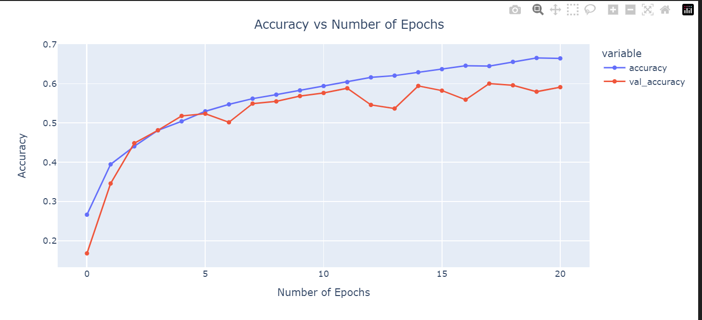
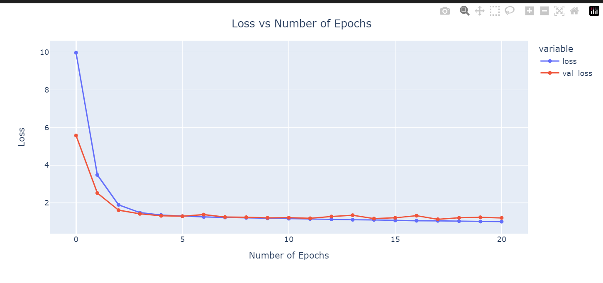

# Emotion Detection using Deep Learning

This project implements a deep learning model for emotion detection using the DenseNet architecture. The model is trained on a dataset containing images of faces expressing different emotions such as anger, disgust, fear, happiness, neutral, sadness, and surprise.

## Getting Started

### Prerequisites

Make sure you have the following installed:

- Python 3.x
- TensorFlow
- Keras
- NumPy
- Pandas
- Matplotlib
- Seaborn
- Plotly
- scikit-learn

### Installation

1. Clone this repository:

- git clone https://github.com/yourusername/emotion-detection.git
Install the required Python packages:
    - cd emotion-detection
    - pip install -r requirements.txt

- Download the pre-trained model file (emotion_detection_model.h5) and place it in the project directory.
- Run the Python script run.py to start real-time emotion detection using your webcam:

### Dataset

The dataset used for training and testing the model can be found in kaggle. Make sure to organize the dataset into the train and test directories, with subdirectories for each emotion category.

### Usage

- Run the run.py file in a python interpretor

### Results

